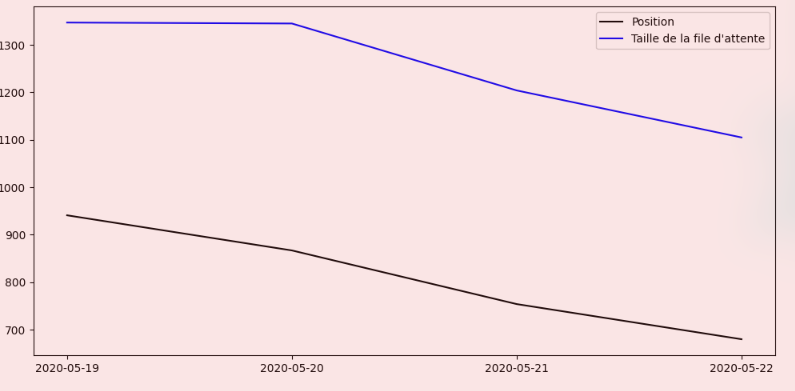

# parcoursup-dataviz

## Installation

You need [poetry](https://python-poetry.org) to install this.
 
```sh-session
$ git clone https://github.com/ewen-lbh/parcoursup-dataviz
$ cd parcoursup-dataviz
$ poetry install
```

## Usage

### Just get the JSON

```sh-session
$ poetry run python parcoursup_dataviz/scraper.py
```

```json
{
    "AAAA-MM-JJ": [
        {
            "id": "identifiant dans le DOM (pas très utile)",
            "name": "Nom de la formation",
            "ranks": {
                "group_capacity": "Capacité du groupe",
                "rank": "Position dans la file d'attente",
                "waitlist_length": "Taille de la file d'attente",
                "calllist_rank": "Position dans la liste d'appel",
                "max_admitted_rank": "Position la plus loin dans la liste d'appel à avoir été acceptée cette année",
                "last_year_max_admitted_rank": "Position la plus loin dans la liste d'appel à avoir été acceptée en 2019",
            },
            "internat": {
                "capacity" : "Capacité de l'internat",
                "group_waitlist_rank" : "Position dans la file d'attente du groupe",
                "rank" : "Position dans la file d'attente",
                "condition_group_waitlist_rank" : "Ont reçu une proposition tout ceux qui était positionnés avant où à cette position dans la file d'attente du groupe (ET voir condition_rank)",
                "condition_rank" : "Ont reçu une proposition tout ceux qui était positionnés avant où à cette position dans la file d'attente (ET voir condition_group_waitlist_rank)",
            }
        }
    ]
}
```

### Get graphs

The scripts takes the same CLI arguments as `scraper.py`

```sh-session
$ poetry run python parcoursup_dataviz/visualizer.py
```

Example for one wish:



NOTE: The wish name has been cut out from the demo image, you'll of course see it.

NOTE: The image is slightly red-tinted here because of my transparent desktop background, the image itself has a perfectly white background.
