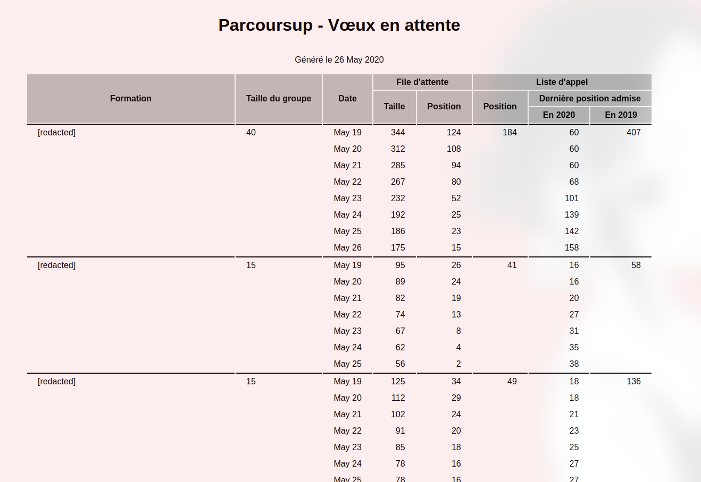
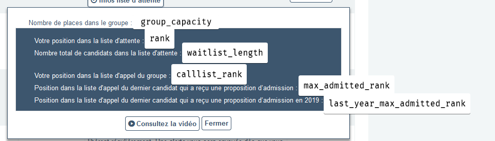
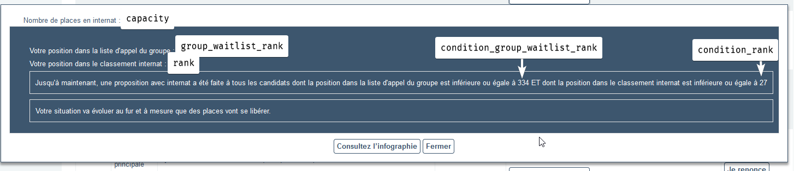

# parcoursup-dataviz


## Installation

:warning: Support for Windows has not been tested for yet :warning:

parcoursup-dataviz is now available on PyPI:

```sh-session
pip install parcoursup-dataviz
```

## Usage

NOTE: Wish names have been cut out from the demo images, you'll of course see them. Images are also slightly red-tinted here because I took screenshots and my computer has transparent windows, the images themselves has a perfectly white background.

Execute `parcoursup-dataviz --help` to get help on all the options available.

### Get graphs

The scripts takes the same CLI arguments as `scraper.py`

```sh-session
parcoursup-dataviz --out my-wishes.png
```

Example for one wish:


### Get a table (WIP)

```
parcoursup-dataviz --table --out my-table.html
```

NOTE: For now "internship" wishes show only N/A values

You can also get a table which looks like this:




### Just get the JSON

```sh-session
parcoursup-dataviz --json
```

```json
{
    "AAAA-MM-JJ": [
        {
            "id": "identifiant dans le DOM (pas très utile)",
            "name": "Nom de la formation",
            "ranks": {
                "group_capacity": "Capacité du groupe",
                "rank": "Position dans la file d'attente",
                "waitlist_length": "Taille de la file d'attente",
                "calllist_rank": "Position dans la liste d'appel",
                "max_admitted_rank": "Position la plus loin dans la liste d'appel à avoir été acceptée cette année",
                "last_year_max_admitted_rank": "Position la plus loin dans la liste d'appel à avoir été acceptée en 2019",
            },
            "internat": {
                "capacity" : "Capacité de l'internat",
                "group_waitlist_rank" : "Position dans la file d'attente du groupe",
                "rank" : "Position dans la file d'attente",
                "condition_group_waitlist_rank" : "Ont reçu une proposition tout ceux qui était positionnés avant où à cette position dans la file d'attente du groupe (ET voir condition_rank)",
                "condition_rank" : "Ont reçu une proposition tout ceux qui était positionnés avant où à cette position dans la file d'attente (ET voir condition_group_waitlist_rank)",
            }
        }
    ]
}
```

Here's where these values are extracted from the website:




