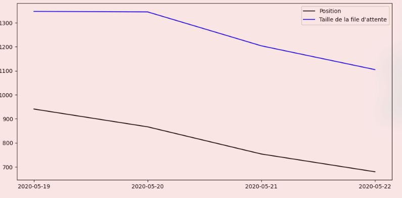
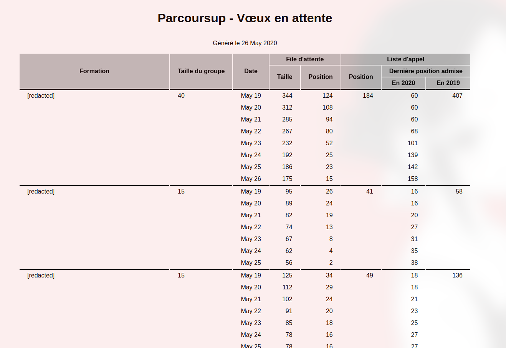

# parcoursup-dataviz

<center> <a href="README_FR.md"> Français </a> &bull; <a href="README.md"> English </a> </center>


## Installation

parcoursup-dataviz est maintenant disponible sur PyPI :

```
pip install parcoursup-dataviz
```

## Utilisation

REMARQUE: Si les noms ont été découpés des images de démonstration, vous les verrez bien sûr. Les images sont aussi légèrement teintées en rouge ici parce que j'ai fait des captures d'écran et que mon ordinateur a des fenêtres transparentes, les images elles-mêmes ont un fond parfaitement blanc.

Exécutez `parcoursup-dataviz --help` pour obtenir de l'aide sur toutes les options disponibles.

### Obtenir des graphiques

Les scripts prennent les mêmes arguments CLI que ceux de `scraper.py`.

```sh-session
parcoursup-dataviz --out my-wishes.png
```

Exemple pour un souhait :



### Obtenir un tableau (WIP)

```
parcoursup-dataviz --table --out my-table.html
```

NOTE : Pour l'instant, les souhaits de "stage" n'indiquent que des valeurs N/A

Vous pouvez également obtenir une table qui ressemble à celle-ci :




### Prendre seulement le JSON

```
parcoursup-dataviz --json
```

```json
{
    "AAAA-MM-JJ" : [
        {
            "id" : "identifiant dans le DOM (pas très utile)",
            "nom" : "Nom de la formation",
            "grades" : {
                "group_capacity" : "Capacité du groupe",
                "rang" : "Position dans la file d'attente",
                "waitlist_length" : "Taille de la file d'attente",
                "calllist_rank" : "Position dans la liste d'appel",
                "max_admitted_rank" : "Position la plus loin dans la liste d'appel à avoir été acceptée cette année",
                "last_year_max_admitted_rank" : "Position la plus loin dans la liste d'appel à avoir été acceptée en 2019",
            },
            "internat" : {
                "capacity" : "capacité de l'internat",
                "group_waitlist_rank" : "Position dans la file d'attente du groupe",
                "rank" : "Position dans la file d'attente",
                "condition_group_waitlist_rank" : "Ont reçu une proposition tous ceux qui était positionnés avant où à cette position dans la file d'attente du groupe (ET voir condition_rank)",
                "condition_rank" : "Ont reçu une proposition tous ceux qui étaient positionnés avant où à cette position dans la file d'attente (ET voir condition_group_waitlist_rank)",
            }
        }
    ]
}
```

Voici où ces valeurs sont extraites du site web :


